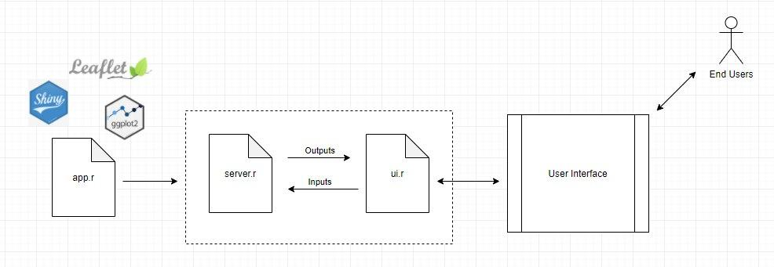

# Motivation

There is presently no application that employs geospatial analysis techniques such as buffering or raster density maps to access the availability of health-advocating amenities from all the three main aspects as mentioned above.

Our application will provide an easy to understand and user-friendly GUI, but will also contain a degree of technical depth such that urban planners can identify and resolve any potential lapses or areas of improvement.

# Objectives

* To build a GIS tool using R Shiny
* Within each subzone, analyse the demand (segmented by age group) and supply of healthy living facilities such as gyms, parks, and healthy eating establishments
* Visualize the proximities of these facilities to residential areas and identify any lapses in accessibility
* Evaluate results of analysis and provide recommendations to further extend the options available for residents to live a healthier lifestyle.

# Reviews of past projects

# Data Sources
* Healthier Eateries 
Dataset for healthier dining partners as eating well is fundamental to good health and well-being. Healthy eating will help Singapore to maintain a healthy body.
https://data.gov.sg/dataset/healthier-eateries

* Bbbike
Dataset allow us to identify safe and short bike routes in Singapore
https://www.bbbike.org/Singapore/

* Gyms@SG
Location dataset of exercise facilities around Singapore. Gym helps to increase
cardiovascular fitness, stronger muscles and maintain a healthy body. 
https://data.gov.sg/dataset/gymssg

* Singapore Planning Subzone (MP14_SUBZONE_WEB_PL) 
Singapore map out at a planning subzone level
https://data.gov.sg/dataset/master-plan-2014-subzone-boundary-no-sea

* Singapore Residents by Subzone, Age Group and Sex, June 2017 (Gender)
Dataset to identify the residents’ details by subzone
Given by Prof Kam

# Methodology
* dplyr
* DT
* ggplot2
* ggpubr
* GWmodel
* leaflet
* olsrr
* plotly
* raster
* RColorBrewer
* rgdal
* rsconnect
* sf
* shiny
* shinydashboard
* shinythemes
* sp
* SpatialAcc
* spdep
* tidyverse
* tmap
* tmaptools

### Data wrangling/Data Cleaning

* Derive and clean the data based on our project scope

### Choropleth Mapping

* Codify the subzone area by using appropriate spatial weight matrix
* Analyse general spatial patterns revealed by subzones

### Buffer Analysis

* Look at the buffer to be in terms of minutes of walk away from the residents’ blocks to the nearest clinics

### Point Pattern Analysis

* Derive and clean the data based on our project scope

### Data wrangling/Data Cleaning

* Kernel Density Estimation
* First order and Second order effects

### Geovisualization
* Provide statistical outcomes into business-friendly representations to allow easy understanding.

# Literature Review

Literature sources
https://wiki.smu.edu.sg/1819t2is415/BusinessMafia_Home

### Literature Review 1:Business Mafia

As our group will be analysing the accessibility of residents to amenities that advocate a healthier lifestyle, we have decided to do literature review business mafia as they have covered the information and methods of how they analyse the accessibility or areas.

Business Mafia is a project from IS415 in 2018. They analyse spatial relationships between various key locations and Airbnb listings in Downtown Seattle to determine how a listing’s location affects the listing prices  They used spatial analysis to allow hosts to visualise and understand the listing’s surroundings better.

Business Mafia has covered geographical accessibility techniques which our group is interested in. Business mafia group used Hansen’s potential model 

Hansen’s potential model allows us to identify geographical accessibility. ‘SpatialAcc’ library from R can be used to build the model. 

They use five parameters, ‘p’, ‘n’, ‘D’, ‘power’ and ‘family’. 

These parameters allow us to quantify the demand and supply of the services in each location. They further analyzed to come out with a matrix of quantity separating the demand from the supply. Also, the distance decay function is used to reflect the rate of increase of friction in the distance. 

Our group will explore more to understand each parameter and use the suitable parameter for our analysis. 

After running the analysis with the ‘SpatialAcc’ package, they use the ‘tmap’ package to visualise. 

R Packages used - might need more, including buffer on corrplot

# Application design storyboard

# System architecture

# Storyboard

# Gantt Chart
[Click here to view our gantt chart](https://projects.hive.com/?shareToken=44r46wc6ScY7MjSSX5MRFfsijvrSZJsPErmyE9sSzNWamBqZEDHFYSXaZrf9kAXP)
